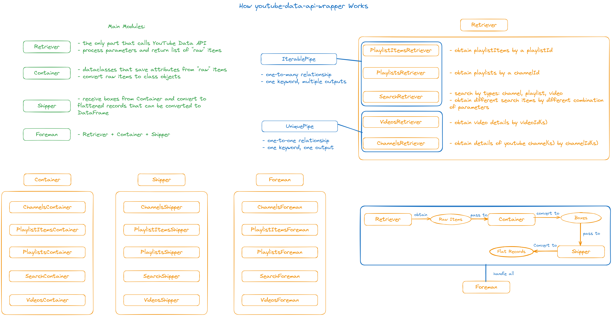

# YouTube Data API Wrapper



<i>Introduction to the wrapper</i>


## Get Started
Install this repo:
```
pip install git+https://github.com/pasto03/youtube-data-api-wrapper.git
```


## Usage
For example, you want to obtain all channel details given a list of channelIds:

(Refer to <a href="./examples/foreman/1 channelsForeman.py"> here</a>)

```python
from youtube_data_api.foreman import ChannelsForeman


# others foreman follow same procedure
channelIds = ["id1", "id2", ...]
foreman = ChannelsForeman()
shipper = foreman.invoke(iterable=channelIds, developerKey="YOUR DEV KEY")

# flattened records
records = shipper.main_records
thumbnails = shipper.thumbnails
```

&nbsp;

Or you want to obtain channel details from given channel names(keywords):

(Refer to <a href="./examples/foreman/2 composite.py"> here</a>)
```python
from youtube_data_api.foreman import SearchForeman, ChannelsForeman
from youtube_data_api.container import SearchContainer
from youtube_data_api.retriever.search.params import SearchTypeCheckboxProps


developerKey = "YOUR DEV KEY"

# 1. obtain corresponding channelIds
keywords = ["k1", "k2", ...]
types = SearchTypeCheckboxProps(channel=True, playlist=False, video=False)   # we want channel results only
foreman1 = SearchForeman()
shipper1 = foreman1.invoke(iterable=keywords, developerKey=developerKey, types=types)
records1 = shipper1.main_records


# 2. obtain channel details
channelIds = [i['channelId'] for i in records1]   # check key from corresponding container object
foreman2 = ChannelsForeman()
shipper2 = foreman2.invoke(iterable=channelIds, developerKey=developerKey)

# final outputs here
records2 = shipper2.main_records
```